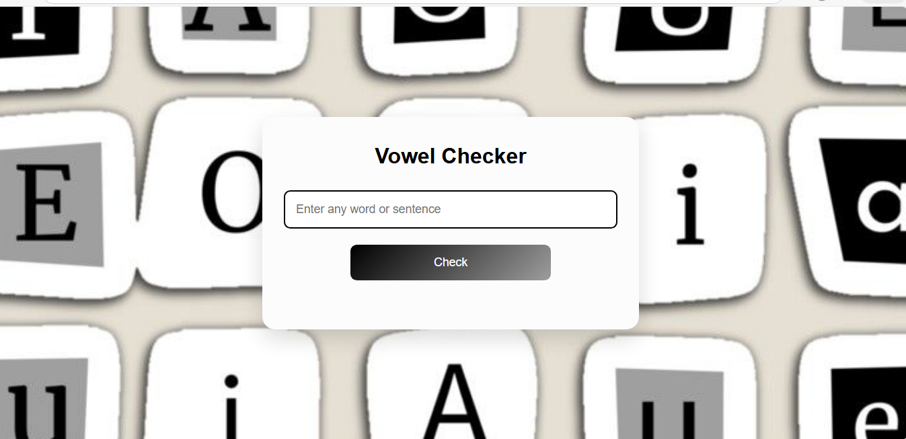

# Vowel Checker App

A simple and interactive **Vowel Checker Application** built using **HTML, CSS, and JavaScript**.  
This project allows users to enter any text, and the app instantly counts how many vowels are present in the input.

---

## 🚀 Features
- Counts vowels in real-time input  
- Clean and minimal UI  
- Error handling for empty input  
- Fully responsive design using rem, %, and flexbox  
- Background image layout for a modern look

---

## 🖥️ Technologies Used
- **HTML5**
- **CSS3** (responsive units: rem, %, vh/vw, flexbox)
- **JavaScript**

---

## 📌 How It Works
1. User enters a word or sentence.
2. Click on **Check** button.
3. JavaScript loops through each character.
4. Vowels (`a, e, i, o, u`) are counted.
5. Results show in green; errors show in red.

---

## 🧩 JavaScript Logic (Summary)
- Takes input value
- Validates empty input  
- Uses an array of vowels  
- Loops through the text  
- Increments count for each vowel found

## Live Preview

(https://vowel-checker-proj.netlify.app/)

---

## Screenshot

---

## Author

Developed by **Ayesha Noor**.

---

If you like this project, consider giving the repo a ⭐ on GitHub!
